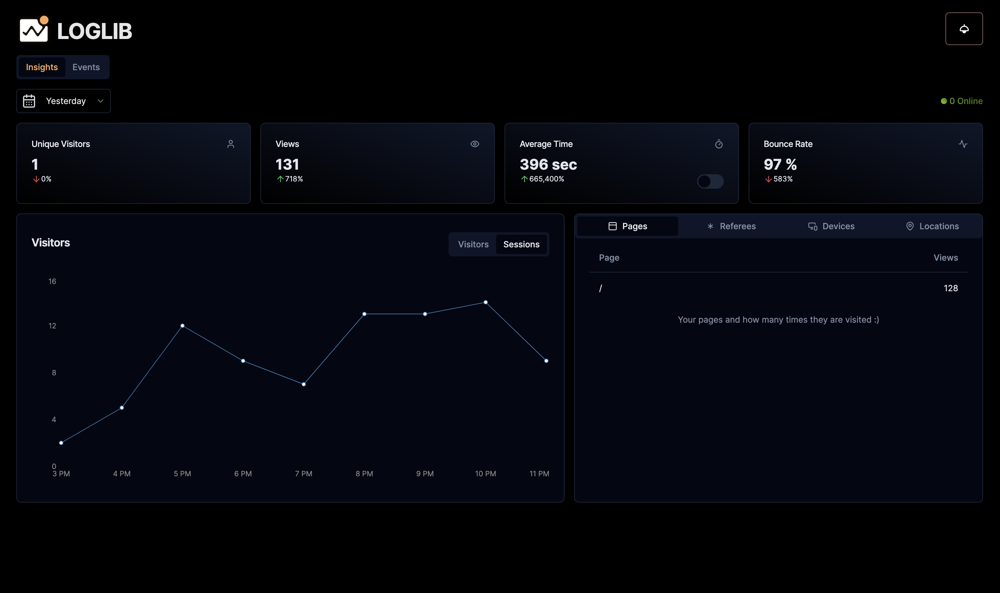

# Loglib

## Crafted with care, privacy first, open source web analytics

    

  

## What is Loglib?

Loglib is a **Open Source** and **Privacy-First** web analytics that aims to provide simple yet can be powerful based on your needs. Admittedly it has beautiful dashboard and it comes with api that you can use to get your data back anytime you want for any purpose.

## Why Loglib?

- **Privacy first**: Loglib is GDPR compliant out of the box. And if you want to customize your privacy settings and use cookie notices you have that option too.

- **Own your data**: We think you should be in control of your data, so we made it easy for you to get your data back anytime you want with our simple APIs. 

- **Events and product analysis features**: We offer powerful event and product analysis features that go beyond simple pageviews. But if you're not into that kind of thing, no worries. Loglib can be as simple or as complex as you need it to be.

- **Developer friendly**: Almost zero config to get started and easy to add to your apps and frameworks.

- **Your mom will be impressed**: Maybe not really, but we think it worth trying.

- **More in the making**: We're always working on new and exciting features to make Loglib even better. So stay tuned, because the best is yet to come.

## Self Hosting

Self-hosting made easy (coming soon): Self-hosting the whole thing can be a pain. That's why we're working hard to make it easy for you to host Loglib on your own servers. Stay tuned for updates on this!

Hosted version (for free): In the meantime, you can use our hosted version of Loglib for free. You can now see your web analytics (despite having no users.)

## Contributing

See [here](./.github/CONTRIBUTING.md) for more information on how to contribute to Loglib.
